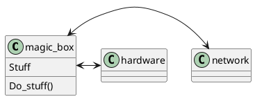

# Design review

## Points on presentation
-   4 points for showing up
-   2 for effort
-   2 for solution

## Parts
-   One part explaining our design
-   One part feedback, being pointed in the right direction

## Diagrams
-   Simple diagrams, show order entered, order handled and light turned
    off
-   Not much specifics required

## Acceptance tests

-   Not reccomded
-   Check for success, not errors
-   Can\'t find all errors anyway
-   Takes effort and needs to be part of the design from the start

## TCP is shady

-   timeouts in \~ 2 min, can\'t tell if connections have timed out.
    Basically no safety if stuff arrived
-   Can\'t tell if receipent is dead until too late
-   UDP is better if you don\'t need messages in the same order
-   Can\'t broadcast
-   Design some protocol for confirming sent~messages~. Acknowledgements
-   Recomends \"Is this peer alive\" functionality. (Pinging 10 times a
    second, decalring dead after 10 lost messages)

## Reconnecting after losing network

-   Just combine orders and possibly redo orders

## Modules

-   Divide into more than network, hardware and magic box
### UML: class diagram

## Timers
-   Either timers for disconnected orders or timers for orders
-   Use timestamps, check periodically
-   Do not ever compare timestamps from different computers, ever.

### Possible solution

-   One thread for timers,
-   One thread for existence of orders

--- Sjekk om ordre fins i elev og watchdog før vi broadcaaster
